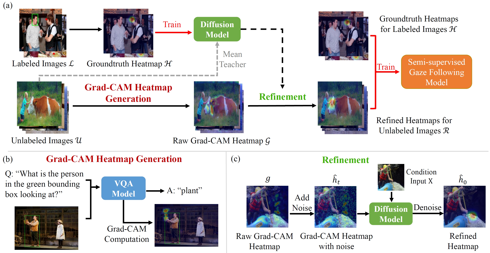

# GCDR-Gaze

## Overview
This is the official implementation of our paper:
**'Diffusion-Refined VQA Annotations for Semi-Supervised Gaze Following'** published in ECCV 2024 [[paper]](https://arxiv.org/pdf/2406.02774)



We propose the first semi-supervised gaze following method, by leveraging VQA priors with Grad-CAM to generate pseudo annotations, and using a diffusion annotation prior to refine the initial noisy Grad-CAM heatmaps. The overall pipeline is shown in the above figure.

## Environment
We used python=3.10, torch=2.1, and cuda-runtime=11.8 in our experiments.

## Dataset
We used [GazeFollow](https://www.dropbox.com/scl/fi/n45q7wig1rvrqf8hsomuw/gazefollow_extended.zip?rlkey=e5b54qgppse4xfk4wc6j2zj2f&e=1&dl=0) and [VideoAttentionTarget](https://www.dropbox.com/scl/fi/x4uqgkwcfjk16l54hm69f/videoattentiontarget.zip?rlkey=5b626ifn2ppdahekfldlkg7nd&e=1&dl=0) datasets in our experiments. 

We extended the annotations by detecting body boxes for the datasets. We also provide the randomly splitted annotations for semi-supervised training in GazeFollow with different amount of annotations. ([GazeFollow](https://drive.google.com/drive/folders/1Xushu7eyg6VrgT3zYJeECd-NbVaBC2wR?usp=sharing). [VideoAttentionTarget](https://drive.google.com/drive/folders/1eBHr4LU9Rmraa7s_avSQZikqlzbcdFki?usp=sharing))

## Grad-CAM Heatmap Generation
We use [OFA](https://github.com/OFA-Sys/OFA) as our VQA model. We modified the original code base to compute the Grad-CAM heatmap at the step when the model generates the key noun in its answer to gaze following question. The Grad-CAM heatmap is computed on the cross-attention layer in the transformer decoder of the VQA model.

The pretrained weights for the VQA model can be downloaded [here](https://drive.google.com/file/d/1lj9oTArIYl-yeotGiKo3LcixInaXjaW9/view?usp=sharing).

Run Grad-CAM heatmap generation:
```
cd GradCAM_Compute
python gradcam_gen_largescale.py
```
We also provide the pre-computed Grad-CAM heatmaps [here](https://drive.google.com/drive/folders/12p0Vn38GFucbxdKUNJUh3mxdVPh_wUw4?usp=sharing).

## Semi-supervised learning with Diffusion Model Refinement
We train a diffusion model (conditioned with features from scene and head images) to refine the initial noisy Grad-CAM heatmaps into high-quality pseudo annotations for the gaze target.

### Training teacher models on supervised data
Train diffusion model on labeled data (We trained 150 epochs with 5% and 10% labels, and 100 epochs for 20% labels):
```
python train_diff_gazefollow.py --device {} --inference_steps 10 --time_steps 500 --onlyin --lr 5e-5 --batch_size 48 --supervise_ratio {0.05/0.1/0.2} --scale_input --scale 2.0 --epochs {} --eval_every 2
```
The diffusion model can also be enhanced by training with unlabeled data using the Mean Teacher method (We trained for 40 epochs for 5% labels,  60 epochs for 10%, and 80 epochs for 20%):
```
python train_diff_gazefollow_meanteacher.py  --device {} --consistency_type kl --remark diff_0.05_teachersample_inf10 --no_inout --supervise_ratio {} --ema-decay 0.99 --batch_size 40 --onlyin --labeled-batch-size 10 --lr 5e-5 --inference_steps 10 --time_steps 500 --batch_size 40 --scale_input --scale 2.0 --consistency 4000 --project_name diff_meanteacher_new --epochs {} --eval_every 2
```

We also provide the code for training baseline teacher models (VAT, VAT-GC):
```
python train_gazefollow_base.py --device {} --batch_size 48 --epochs 40 --no_inout --lr 2.5e-4 --supervise_ratio {} --model {} --eval_every 2
```

### Semi-supervised training with the trained diffusion model

```
 python train_gazefollow_semisup.py --device {gpuid} --teacher_model diffusion --teacher_ckpt {weights for trained teacher model} --time_steps 500 --supervise_ratio {0.05/0.1/0.2} --no_inout --onlyin --labeled_batch_size 20 --batch_size 80 --scale_input --scale 2.0  --model baseline --denoise_steps {} --inference_steps 2 
```
We set the "denoise_steps" argument as 200 when training with 5% labels, and 250 for other ratios.

You can use the same code to test the performance for other baseline teacher models by changing the "teacher_model" argument.

## Citation
If you find our method/code useful, please cite as follow:

```bibtex
@article{miao2024diffusion,
  title={Diffusion-Refined VQA Annotations for Semi-Supervised Gaze Following},
  author={Miao, Qiaomu and Graikos, Alexandros and Zhang, Jingwei and Mondal, Sounak and Hoai, Minh and Samaras, Dimitris},
  journal={arXiv preprint arXiv:2406.02774},
  year={2024}
}
```

## Contact
If you have any questions, please email Qiaomu Miao at qiamiao@cs.stonybrook.edu.
